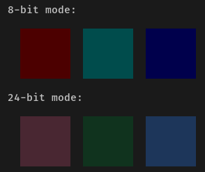

# colorcheck

The `colorcheck` command can be used to test whether or not your terminal emulator
properly supports 24-bit true color mode (16,777,216 colors). If this is not the case, `pastel`
can only show 8-bit approximations (256 colors):

``` bash
pastel colorcheck
```

If everything works correctly, the output should look likes this (the background color and font
colors may be different, but the color panels should look the same):



If you find it hard to compare the colors visually, you can also use a colorpicker (`pastel pick`)
to make sure that the three colors in the 24-bit panels are (from left to right):

 * `#492732`, `rgb(73, 39, 50)`
 * `#10331e`, `rgb(16, 51, 30)`
 * `#1d365a`, `rgb(29, 54, 90)`
